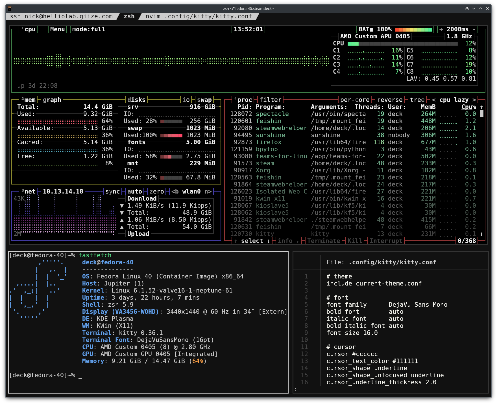

# Kitty
My personal configuration for the Kitty terminal emulator.

Some things to note are that this configuration is **not** made in mind with macOS compatibility and the keybinds are significantly different than the original Kitty configuration. Use this as a template for your own configuration instead of adapting to mine as this is a very personalized configuration!
